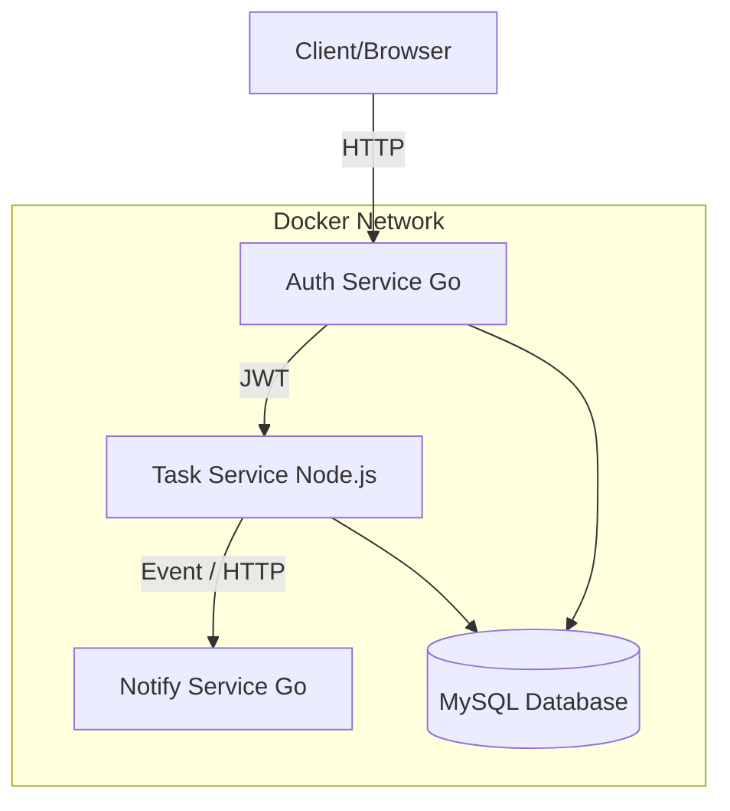

# Mini Production Platform

This project simulates a real-world production environment using Microservices, Docker, and Ansible. It demonstrates microservices architecture, Docker multi-stage builds, service orchestration, and secure infrastructure automation.

## Architecture Diagram



## Technologies Used
* **Auth Service:** Go (Gin), JWT, bcrypt
* **Task Service:** Node.js (Express)
* **Notify Service:** Go (Standard Library)
* **Database:** MySQL 8.4
* **Containerization:** Docker & Docker Compose
* **Automation & Security:** Ansible & Ansible Vault

## How to run locally using Docker Compose
1. Clone the repository.
2. Copy the example environment file: `cp .env.example .env` and fill in your local variables.
3. Build and start the containers:
   ```bash
   docker compose up -d --build
   ```
4. Access the Auth Service on port `8000` and the Task Service on port `3000`.

## How to deploy using Ansible (Production)
This project uses Ansible to automate the deployment to a clean VM, including installing Docker, configuring UFW firewalls, and deploying the application using encrypted secrets.

1. Ensure you have Ansible installed on your control node.
2. Update the `ansible/inventories/dev` file with your target server's IP address.
3. Run the playbook with your Ansible Vault password and Sudo password:
   ```bash
   cd ansible
   ansible-playbook -i inventories/dev site.yml -K --ask-vault-pass
   ```
````

### Step 3: Save and Push
Save the file in `nano` (Press **Ctrl+O**, then **Enter**, then **Ctrl+X**).

Then push it to GitHub one last time:
```bash
git add Readme.md
git commit -m "Fix markdown spacing for Mermaid diagram"
git push
```
